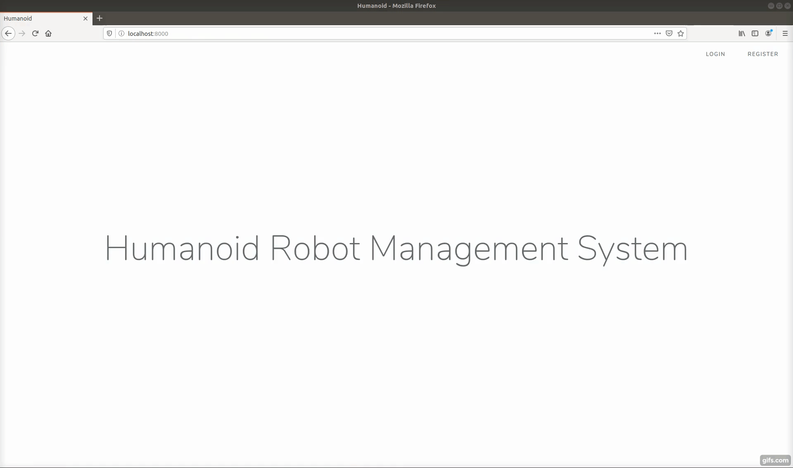
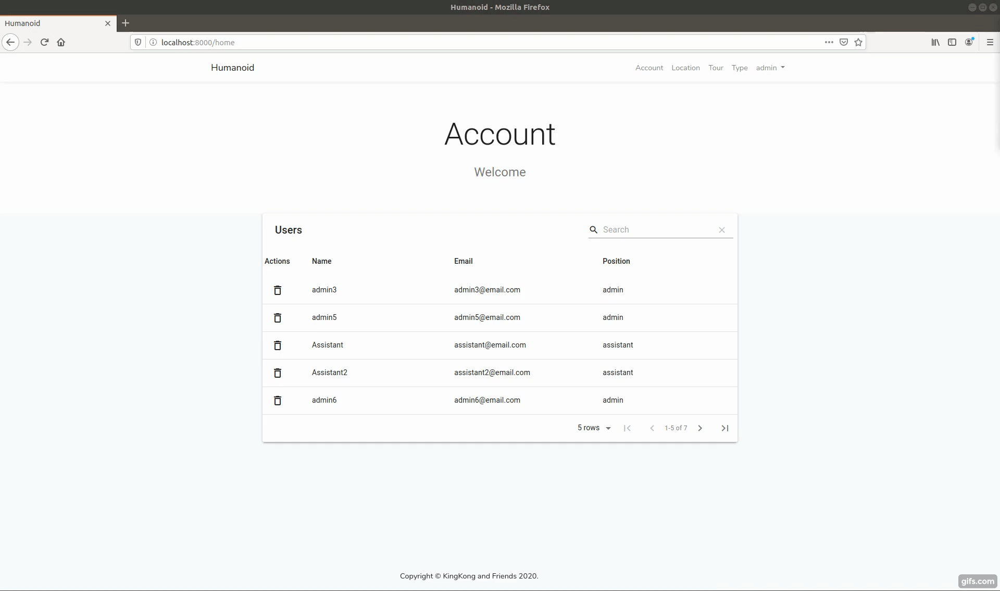
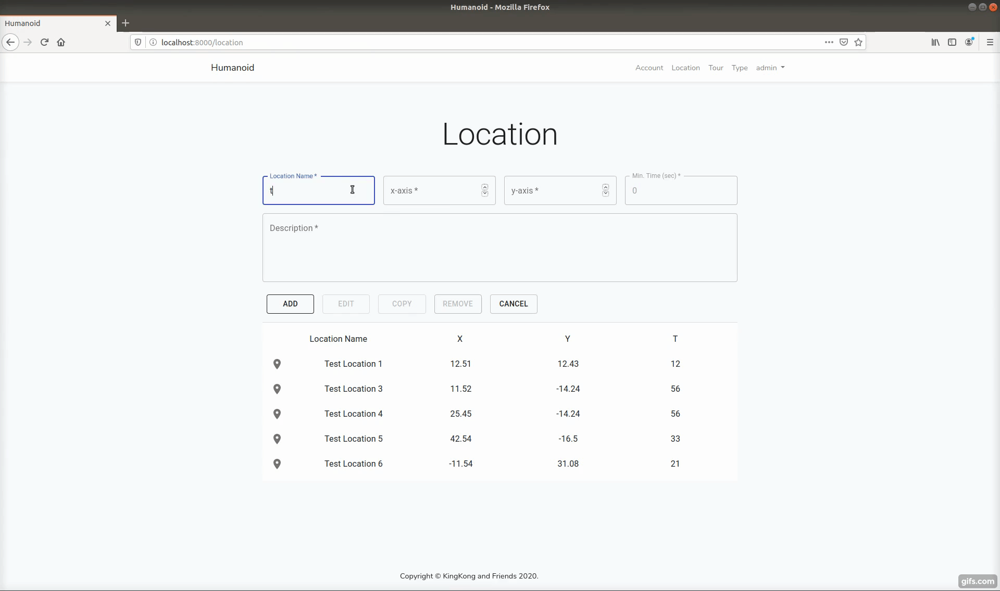
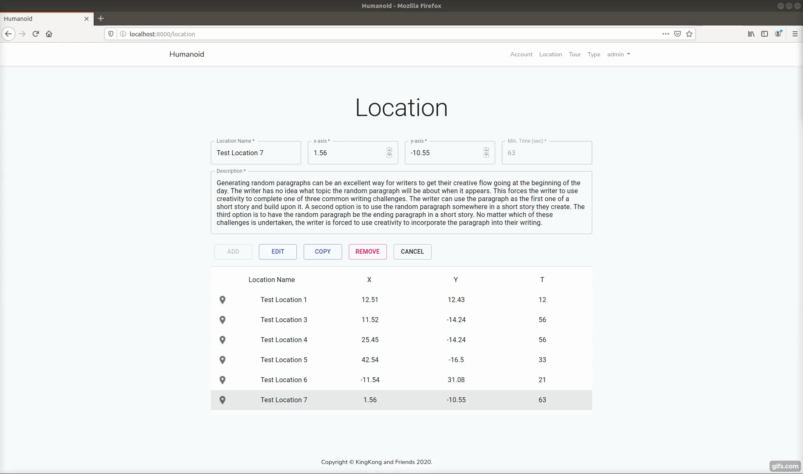
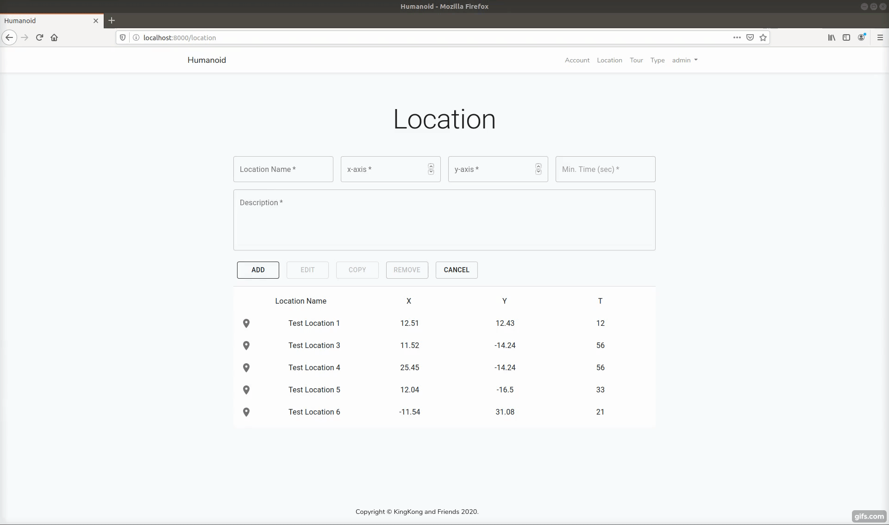
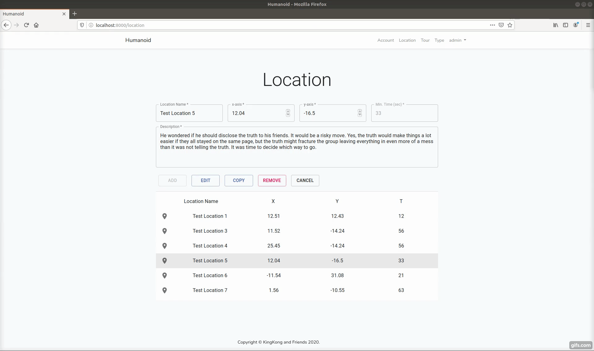
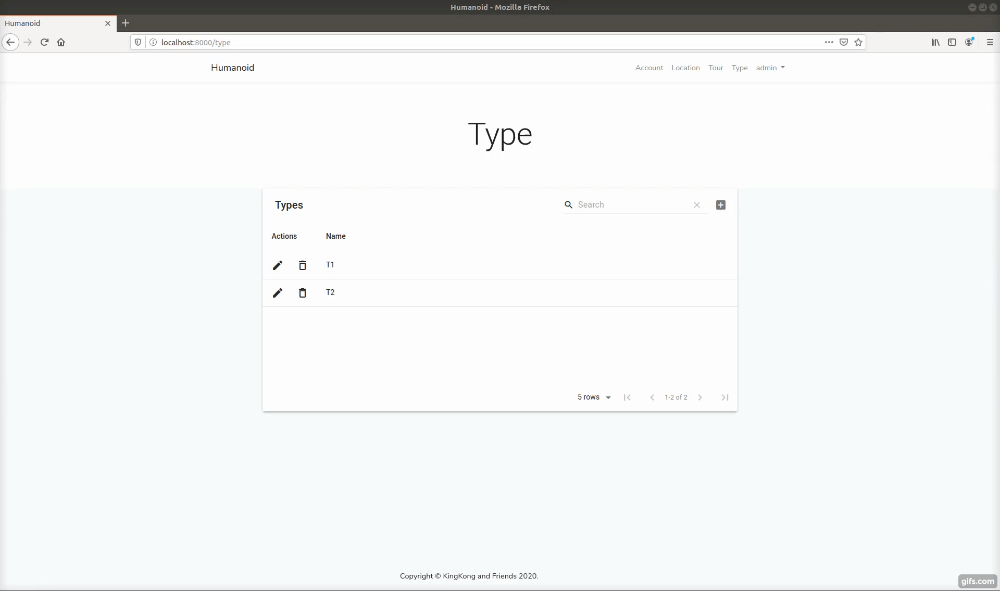
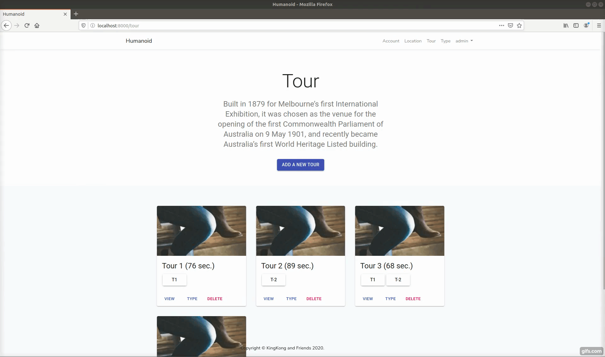

## About Humanoid Management System

Humanoid Management System is a web application that can be used to manage tour details (locations and types) conducted by a humanoid robot in an exhibition centre. The application is built by using

- [Laravel](https://laravel.com/).
- [MySQL](https://www.mysql.com/)
- [Axios](https://github.com/axios/axios).
- [React](https://reactjs.org/).
- [MATERIAL-UI](https://material-ui.com/).
- [Bootstrap](https://getbootstrap.com/).

# Requirements
• Create accounts for new admins and assistants</br>
• Deactivate admin and assistant users</br>
• Add new locations to the set of locations: a location should be specified by its name, x-y coordinates, description, and the
min. time to be spent on the location (the time depends on the length of the description, as the robot will “pronounce” it
using text-to-voice feature)</br>
• Edit existing locations (name, x-y coordinates, description, min. time)</br>
• Copy existing locations</br>
• Remove existing locations</br>
• Edit the set of tour types – add new types, remove the types that are unnecessary, change the type label</br>
• Create a new tour out of the specified locations: the tour should be specified by its name, type, min. duration (which is a
sum of the minimal times to spend at each location)</br>
• Edit existing tours - add or remove locations, edit type labels</br>
• Remove existing tours</br>

## Setting up

1. Git clone
```
$ git clone https://github.com/s3634359/humanoid
$ cd humanoid
```

2. Install Backend Libraries
```
$ composer install
```

3. Install Frontend Libraries
```
$ npm install
or
$ yarn add
```

4. Create .env File
- Copy .env.example file and name it .env
- Enter your app key and database configurations

5. Migrate
```
$ php artisan migrate
```

6. React 
```
$ npm run development
or
$ yarn dev
```

7. Serve
```
$ php artisan serve
or
$ yarn serve
```

7. Test
```
$ vendor/bin/phpunit
or
$ yarn test
```

# Product
#### • Create accounts for new admins and assistants


#### • Deactivate admin and assistant users


#### • Add new locations to the set of locations: a location should be specified by its name, x-y coordinates, description, and themin. time to be spent on the location (the time depends on the length of the description, as the robot will “pronounce” it using text-to-voice feature)


#### • Edit existing locations (name, x-y coordinates, description, min. time)


#### • Copy existing locations


#### • Remove existing locations


#### • Edit the set of tour types – add new types, remove the types that are unnecessary, change the type label


#### • Create a new tour out of the specified locations: the tour should be specified by its name, type, min. duration (which is a sum of the minimal times to spend at each location)


#### • Edit existing tours - add or remove locations, edit type labels


#### • Remove existing tours</br>



## Scrum (Software Development Framework)
### Documetation Covered
##### • Product Backlog
##### • Project Charter
##### • Sprint Backlog
##### • Sprint Planning Notes
##### • Sprint Retro Meeting Notes
##### • User Story
##### • Burndown Chart
##### • Test Case

### Tools for implementation
#### Trello Board


### UML Diagram

